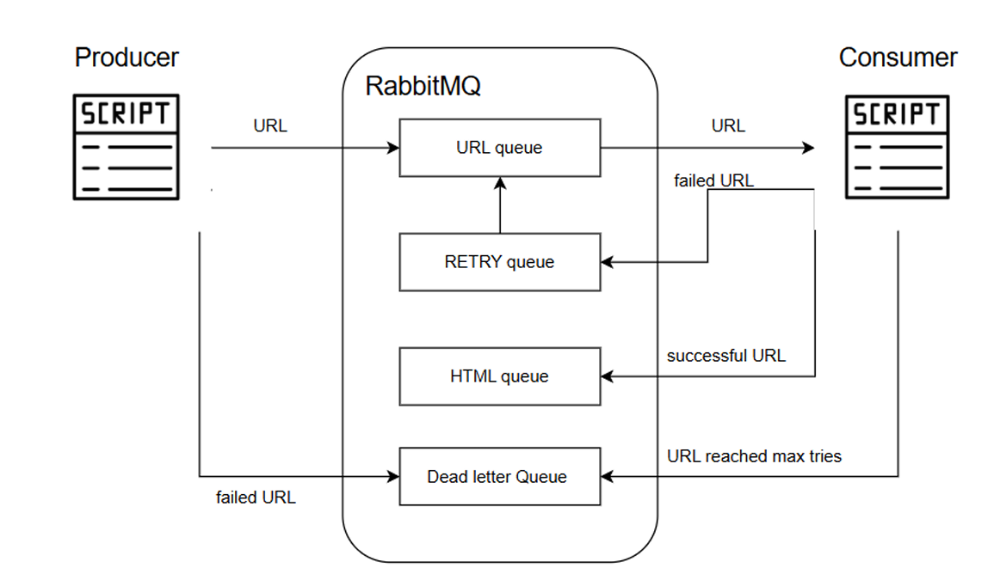
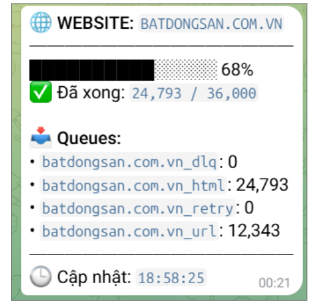
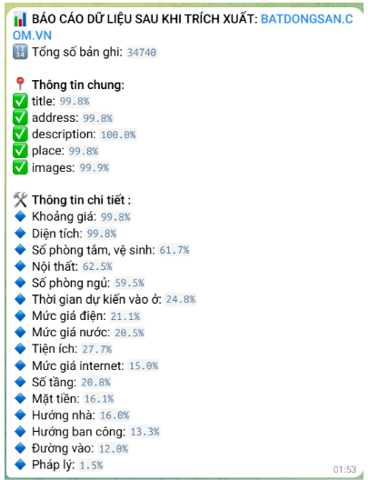

Rental Real Estate Data Pipeline in Vietnam
This repository focuses on the Data Engineering core of the project. It handles the end-to-end ELT process: from crawling rental listings across various websites to processing and storing them in a structured format for AI-powered querying.

🏗️ Architecture Overview
The pipeline is designed with a modern Medallion Architecture and event-driven ingestion to ensure data reliability and scalability.

## Ingestion Layer (Event-Driven)
- Producer: Scrapes URLs from rental websites and pushes them to RabbitMQ.

- RabbitMQ: Acts as a message broker with a robust retry mechanism, including URL queue, RETRY queue, and Dead Letter Queue to handle failed requests.

- Consumer: Fetches URLs from the queue, downloads the HTML content, and prepares it for storage.

## Storage and Processing Layer (Medallion Architecture)
Data is organized into three distinct zones using Delta Lake and MinIO:

- Raw Zone (Bronze): Stores the raw HTML/JSON data exactly as collected (Batch writing).

- Parsed Zone (Silver): Cleaned and structured data after parsing raw HTML.

- Processed Zone (Gold): Aggregated and normalized data, ready for vector embedding and serving.

## Orchestration & Monitoring
- Orchestration: Managed by Apache Airflow to schedule and monitor the entire workflow.

- Monitoring: A dedicated layer tracks queue states and data quality, sending real-time alerts via Telegram.

| Queue State Monitoring | Data Quality Monitoring |
| :---: | :---: |
|  |  |

### 🛠️ Tech Stack
- Language: Python

- Message Broker: RabbitMQ

- Storage: MinIO, Delta Lake

- Orchestrator: Apache Airflow

- Monitoring: Python Scripts, Telegram Bot API